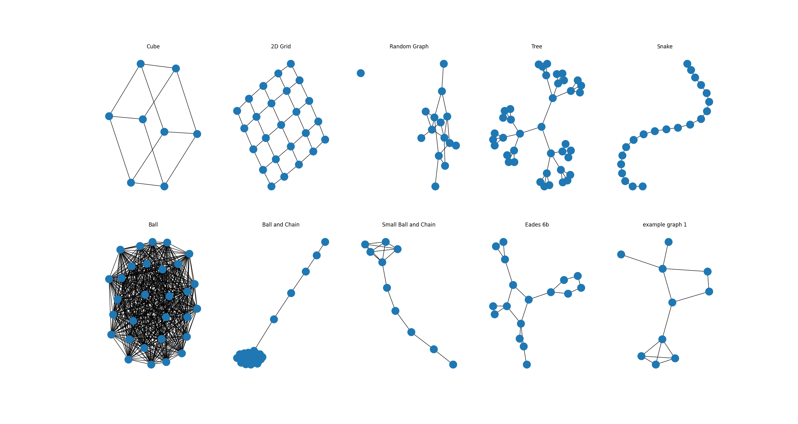
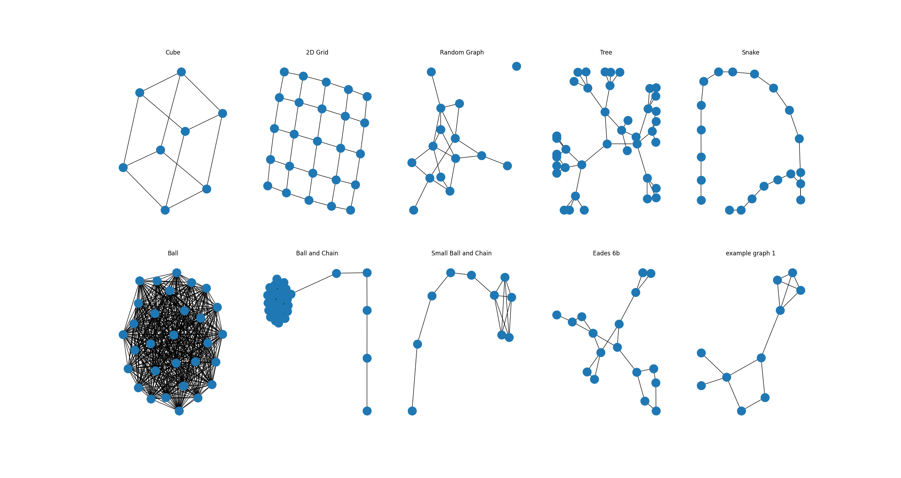
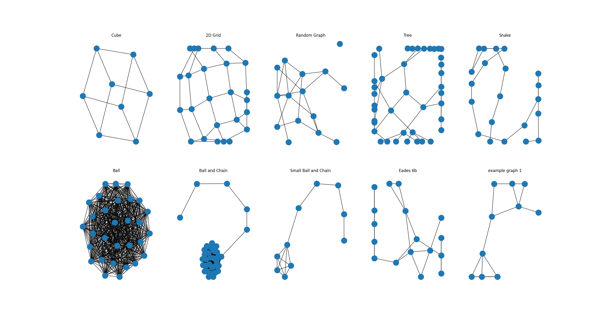
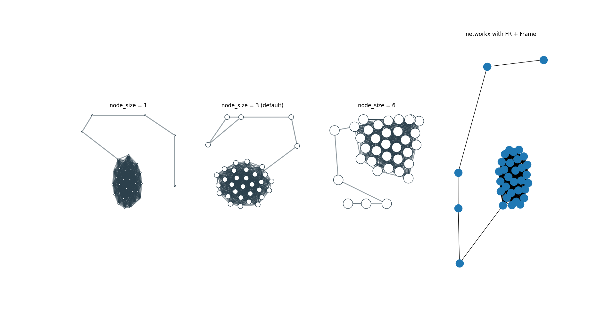

# Evaluation of the Fruchterman Reingold Graph Layout Algorithms for NetworkX

The original implemenation of the Fruchterman-Reingold (FR) algorithm in
NetworkX had several differences compared to the original paper.

- instead of `f_a = d**2/k` and `f_r = -k**2/d` the forces `f_a = d**2 / k**2`
  and `f_r = k**2/d**2` have been used.
- no frame was implemented
- instead of using the temperature as a upper limit for the movement of a node
  per iteration it was used as the movement of a node per iteration.
  The actual force calculation was only used to get a direction for that movement.

I fixed these issues and implemented them in the way they are described on the
paper.
The only difference is that instead of clipping the positions at the frame I implemented
a sort of inelastic collision.
If a node would be moved out of the frame it simply stays at its old position.
This prevents the issue that multiple nodes are pushed into the corners of the
frame and therefore have the same position.

After implementing these changes I realized, that many graphs get pushed into
the boundary.
The problem lies in the calculation of the optimal edge length.
It calculates the distance between two adjacent nodes if all nodes are distributed
perfectly evenly in the frame.
However the chance of distributing a graph perfectly evenly in practice is almost 0.
Therefore the edges are too long and many nodes are pushed into the frame.

## Overview of the used graphs:

networkx code for all graphs can be found in `example_graphs.py`.

When drawing the graphs with the FR algorithm with the changes described above
we get the following layouts:

With `C=0.2`

With `C=0.5`

With `C=1.0`

## Detailed analysis

# The completly unconnected graph

TODO

# Analysis of the Ball and Chain graph

The ball and chain graph was one of the initial example problems.
It connects the complete Graph K_30 with a chain of 5 additional nodes.
In the initial example the problem was, that the ball itself in relation to the
chain had the majority of nodes but only a very small amount of the actual space
in the resulting image.
In the example given by netgraph the distribution was a lot better.

The Ball part of the graph is completly connected.
This means that there are many attractive forces between those nodes which in
sum are very strong.
If we draw only the ball itself with the initial implementation of networkx
and calculate the longest distance between any two nodes the ball has a
diameter of only ~0.296 with the optimal edge length being ~0.183.
So the ball by itself is very small. The part of the frame that will be scaled
up to fill the screen is only about 9% of the 1x1 frame that was assumed for
the calculation of the edge length.

If we add the chain we get more nodes which makes k smaller (~0.169) which would
shrink the ball part under its own forces even further.
However adding the chain makes the ball slightly bigger in diameter (~0.307).
The problem of the resulting image is that the chain gets straightend and
pushed very far away from the ball.
After scaling this leads to a very small, a very long chain and a lot of empty
space.

If we add a frame and implement the FR algorithm as described in the paper
the ball gets slightly smaller. If we reduce `C` the ball gets even smaller
but the diameter is roughly identical relative to `k`.

We also see other problems.
For a high value of `C=1` the chain gets pushed into the boundary.
However the ball itself does not get bigger.
Only after the scaling the ball itself is bigger due to the length of the chain
being limited by frame.

Smaller values of `C`, e.g `C=0.2` make the ball very small (diameter of ~0.06)
and the edges are now short enough that the chain can be straightend.
The result is a very small ball after scaling.

When comparing the result of the drawing with `C=1.0` with the implementation
in netgraph the ball in netgraph is a lot bigger.
However the forces involved are identical.
The difference is that netgraph nodes have a size and that size
is subtracted from the distances.
This node size is large enough to make up a big portion of the edge length
and therefore extend the size of the ball considerably.

Take a look at the following picture which compares the the output for the
`node_size` parameter with values 1, 3 (default) and 6.

We can clearly see how the ball is getting bigger with increasing
node size. For `node_size=6` the graph gets to big for the frame and the
ball is no longer round because it is pushed into a corner.

So a large part part of the better vertex distribution in the ball and chain
example is due to the ball simply being bigger because the edge length is
calculated differently.

# Analysis of different edge length

  - with C=1
  - disconnected graphs

# general differences between the networkx and netgraph graph drawing

netgraph has the concept of a node size.
This size is relativ to the size of the drawing.
The nodes in networkx have a size that is relative to the actuall screen space
they are displayed on.

This means that when we use the matplotlib zoom utility the size of the nodes
on the screen becomes bigger when using netgraph and stays identical when using
networkx.

This brings an advantage in networkx when zooming in, because it gives us more
space for the edges. However graphs with very densly packed nods overlap often
as we can see in many of the ball-and-chain graph examples.
